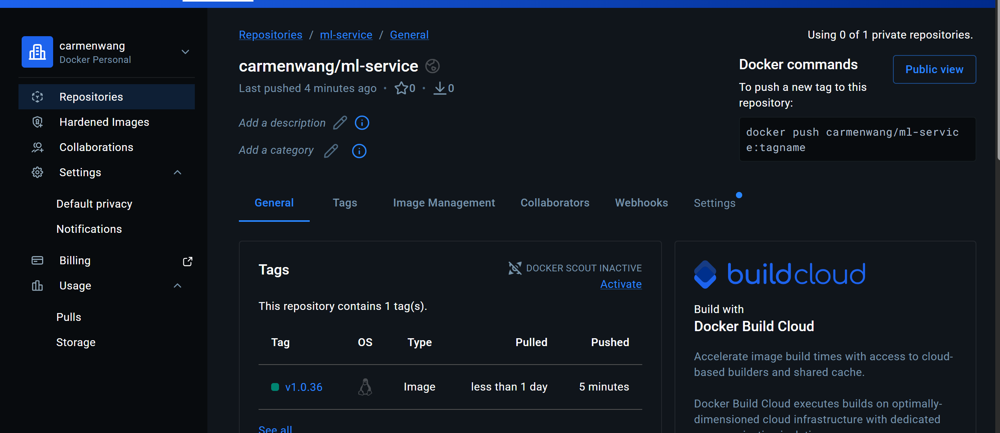

# Module 3 – Milestone 2  
FastAPI ML Service with CI/CD & Docker

## Overview
This project implements a minimal production-style ML inference service using:
- FastAPI (API layer)
- Pytest (automated validation)
- Docker multi-stage builds
- Version-pinned dependencies
- GitHub Actions CI pipeline
- Semantic version tag-based release trigger
The goal is to simulate a real-world ML model deployment workflow with reproducibility and automation.
---

## ML Lifecycle Alignment
This milestone represents the **Model Serving & Deployment phase** of the ML lifecycle:
1. Model logic exposed via `/predict`
2. Unit tests validate correctness
3. Dependencies pinned for reproducibility
4. Docker container ensures portability
5. CI pipeline validates before release
6. Tagged release triggers container build & push
This mirrors production-grade inference deployment practices.
---
## API Endpoints
1. Health Check
GET `/`
Response:
{ "status": "ok" }
2. Prediction Endpoint
POST `/predict`
Request:{ "x": 3 }
Response:{ "prediction": 6 }
---
## Local Setup Instructions
Clone repository:
git clone https://github.com/MengyiWang-W/IDS568-Project.git
cd module3/milestone2

Install dependencies:
pip install -r app/requirements.txt

Run server locally:
uvicorn app.app:app --host 0.0.0.0 --port 8000

Run tests:
pytest -v
---
## Docker Usage
Build image:
docker build -t ml-service .

docker pull carmenwang/ml-service:v1.0.36
docker run -p 8000:8000 carmenwang/ml-service:v1.0.36
---
## CI/CD Workflow
The pipeline is triggered on semantic version tags:
vX.Y.Z

Example:
git tag v1.0.2
git push origin v1.0.2

Pipeline steps:
- Checkout repository
- Install pinned dependencies
- Run tests
- Build Docker image
- Push image to registry
---
## Dependency Pinning Strategy
All dependencies are pinned to exact versions in:
app/requirements.txt

This ensures:
- Deterministic builds
- CI parity
- Protection from upstream breaking changes
- Stable Docker layers
---
## Docker Optimization
Dockerfile design includes:
- `python:3.11-slim` base image
- Multi-stage build (builder + runtime)
- `--no-cache-dir` installation
- Minimal runtime footprint
- Reduced attack surface

## Image Size Optimization
Measured using: docker images
Single-stage image size: 232MB
Multi-stage image size: 213MB
Size reduction: 8%
---

## Key Concepts Demonstrated
- API-first ML deployment
- Reproducible dependency management
- Multi-stage Docker builds
- CI test gating before release
- Semantic versioning workflow
- Automated container publishing

## Versioning Strategy
We follow semantic versioning:
MAJOR.MINOR.PATCH
Tags trigger CI build & Docker publish workflow.